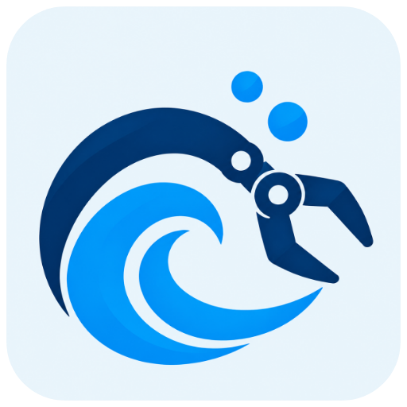
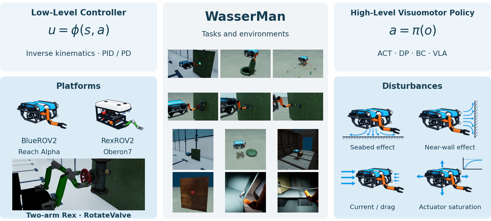

#  WasserMan

**Benchmark for Underwater Manipulation Policy Learning.**

[](https://dancher00.github.io/wasserman/docs/installation/) [](https://dancher00.github.io/wasserman/docs/installation/) [](https://dancher00.github.io/wasserman/docs/installation/) [](LICENSE) [](https://dancher00.github.io/wasserman/docs/benchmark/)


<p align="center">
  <picture>
    <source media="(prefers-color-scheme: dark)" srcset="assets/teaser-dark.png">
    <source media="(prefers-color-scheme: light)" srcset="assets/teaser-light.png">
    
  </picture>
</p>

WasserMan is a simulation benchmark for underwater vehicle–arm manipulation,
with contact tasks, water forces and visual policy learning.

## Key Features

- **10 tasks** — contact, recovery, delivery and underwater intervention; nine have learned-policy evaluations.
- **Two robot platforms** — BlueROV2 Heavy + Alpha 5 and RexROV2 + Oberon7, plus bimanual valve manipulation.
- **Visual baselines** — ACT, Diffusion Policy and chunked BC on six tasks; SmolVLA on three tasks, each with three training seeds.
- **Underwater physics and control** — currents, buoyancy, thruster response, PID/PD comparisons, optional wall/seabed effects and camera imaging.
- **Reproducible evaluations** — task contracts, splits, checkpoints and recorded outcomes: 3,780 learning/intervention episodes and 270 SmolVLA test episodes.

## Installation

Requires native Linux, Python 3.12 and a compatible NVIDIA GPU/driver.
The open core uses Isaac Sim 6.1, Isaac Lab and procedural arm geometry.

```bash
git clone --branch main https://github.com/dancher00/wasserman.git
cd wasserman
./scripts/bootstrap.sh --asset-profile open-procedural-v1
.venv/bin/python scripts/setup_policy_dependencies.py
.venv/bin/python scripts/setup_training_backbones.py
uv pip install --python .venv/bin/python --no-deps -r research/media-requirements.txt
export WASMAN_ASSET_PROFILE=open-procedural-v1
```

The installer verifies the scientific runtime files bundled with this checkout.
See [Installation](https://dancher00.github.io/wasserman/docs/installation/) and [Verify installation](https://dancher00.github.io/wasserman/docs/first-run/).

## Quick Start

Step an environment with zero actions:

```bash
OMP_NUM_THREADS=4 .venv/bin/python scripts/rollout_button_visual.py \
  --mode zero --purpose development --seeds 31000 --steps 16 \
  --output-dir artifacts/installation-zero
```

Record a development demonstration:

```bash
OMP_NUM_THREADS=4 .venv/bin/python scripts/benchmark.py collect \
  --task PressButton --purpose development --seeds 31000 \
  --output-dir artifacts/button-demo
```

Use a fresh output directory for each run. The 16-step check verifies loading and
stepping; it does not measure success. Follow the [training guide](https://dancher00.github.io/wasserman/docs/train-policies/)
and [frozen protocol](https://dancher00.github.io/wasserman/docs/revision-v2-protocol/)
for full experiments. No pretrained visual-policy download is needed to start.

## Documentation

[Guides](https://dancher00.github.io/wasserman/docs/) cover collection, training, evaluation and extending the
benchmark. See [models and evidence](https://dancher00.github.io/wasserman/docs/artifacts/),
[policy results, including SmolVLA](https://dancher00.github.io/wasserman/docs/benchmark-results/),
[bimanual studies](https://dancher00.github.io/wasserman/docs/studies/bimanual-valve-v1-reproduction/) and
[Contributing](CONTRIBUTING.md).
The [website source](https://github.com/dancher00/dancher00.github.io) lives in a separate repository.

## Citation

```bibtex
@software{wasserman2026,
  title = {{WasserMan}: Benchmark for Underwater Manipulation Policy Learning},
  year = {2026},
  version = {0.1.0},
  url = {https://github.com/dancher00/wasserman}
}
```

Software citation metadata: [CITATION.cff](CITATION.cff).

## License

[Apache License 2.0](LICENSE). Third-party components retain their own terms;
restricted robot CAD and Isaac Sim binaries are not redistributed.
See [Third-party notices](THIRD_PARTY_NOTICES.md).
